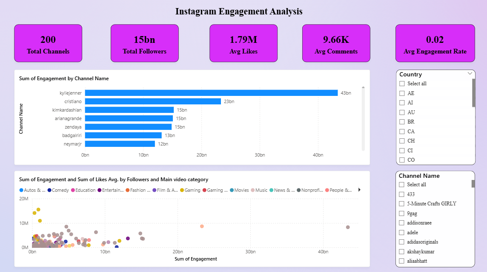

# 📊 Instagram Engagement Dashboard

## 📌 Project Overview
This project analyzes Instagram channel performance using engagement metrics such as likes, comments, views, and engagement rate.  
The dashboard helps identify top-performing channels, categories, and content strategies.

## 🧰 Tools Used
- Python (Pandas)
- Power BI
- CSV Dataset
- GitHub

## 📂 Dataset
- Instagram engagement data (200 channels)
- Metrics include:
  - Likes Avg.
  - Comments Avg.
  - Views Avg.
  - Engagement Rate
  - Followers
  - Main Video Category

## 📊 Dashboard Pages
### 1️⃣ Overview

## 🔍 Key Insights
- Channels with medium followers often have higher engagement
- Certain video categories outperform others
- Engagement rate decreases as followers increase

## 📁 Files Included
- Power BI Dashboard (.pbix)
- Cleaned Dataset (.csv)
- Dashboard Screenshots

## 👤 Author
**Vinayak Pawate**
